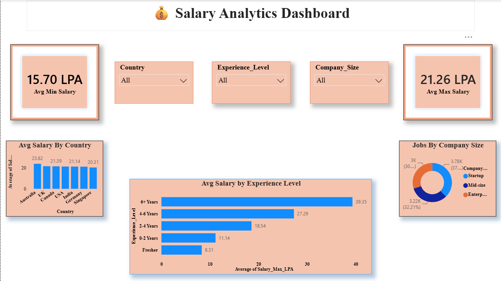
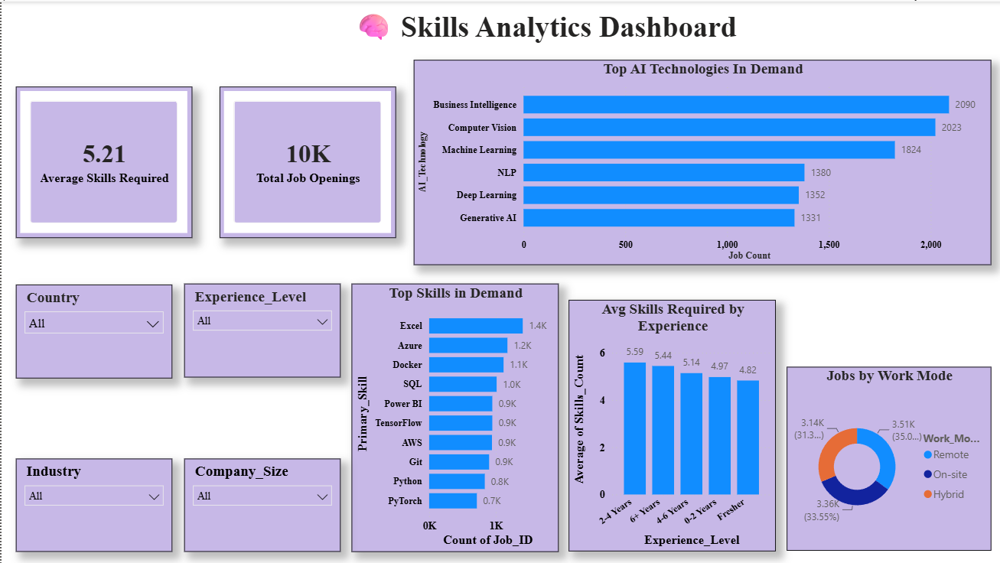

# 🌍 AI Job Market Analytics Dashboard

A professional **Power BI Dashboard** that analyzes the global AI job market using a dataset of **10,000 job postings**. The dashboard provides insights into hiring trends, salary distributions, company hiring, required skills, and work modes through interactive visualizations.

---

## 📌 Project Overview

The AI Job Market Analytics Dashboard helps users explore:

- 🌍 Job opportunities across different countries
- 💰 Average minimum and maximum salary (LPA)
- 🏢 Top hiring companies
- 🧠 Most in-demand AI technologies
- 📈 Skills required based on experience
- 💼 Job distribution by work mode
- 🎯 Interactive filtering using slicers

This project demonstrates data cleaning, modeling, DAX measures, and dashboard design using Microsoft Power BI.

---

# 📊 Dashboard 1 – AI Job Market Analytics


### Key Insights

- ✅ Total Jobs
- ✅ Total Companies
- ✅ Average Minimum Salary (LPA)
- ✅ Average Maximum Salary (LPA)
- ✅ Total Applications
- ✅ Jobs by Country
- ✅ Top Hiring Companies

### Interactive Filters

- Country
- Work Mode
- Job Type

---

# 💰 Dashboard 2 – Salary Analytics



### Key Insights

- Average Minimum Salary
- Average Maximum Salary
- Salary by Country
- Salary by Experience Level
- Jobs by Company Size

### Interactive Filters

- Country
- Experience Level
- Company Size

---

# 🧠 Dashboard 3 – Skills Analytics



### Key Insights

- Average Skills Required
- Total Job Openings
- Top AI Technologies
- Top Skills in Demand
- Average Skills Required by Experience
- Jobs by Work Mode

### Interactive Filters

- Country
- Experience Level
- Industry
- Company Size

---

# 📂 Dataset Information

| Property | Details |
|----------|---------|
| Dataset Size | 10,000 Rows |
| Format | Excel (.xlsx) |
| Tool Used | Microsoft Power BI |
| Salary Unit | LPA (Lakhs Per Annum) |

---

# 🛠 Tools & Technologies

- Microsoft Power BI
- Power Query
- DAX
- Microsoft Excel

---

# 📈 Dashboard Features

- Interactive Slicers
- KPI Cards
- Bar Charts
- Donut Charts
- Column Charts
- Dynamic Filtering
- Cross-filtering between visuals
- Clean Dashboard Design

---

# 📁 Project Structure

```
AI-Job-Market-Analytics/
│
├── AI_Job_Market_Analytics.pbix
├── AI_Job_Market_Dataset.xlsx
├── README.md
│
├── images/
│   ├── dashboard1.png
│   ├── dashboard2.png
│   └── dashboard3.png
```

---

# 🚀 How to Use

1. Clone this repository

```
git clone https://github.com/your-username/AI-Job-Market-Analytics.git
```

2. Open the `.pbix` file using **Microsoft Power BI Desktop**

3. Refresh the dataset if required.

4. Explore the dashboards using the interactive filters.

---

# 🎯 Skills Demonstrated

- Data Cleaning
- Data Transformation
- Data Modeling
- DAX Measures
- Dashboard Design
- Business Intelligence
- Data Visualization
- Interactive Reporting

---

# 📷 Dashboard Preview

| Dashboard | Description |
|-----------|-------------|
| 🌍 AI Job Market Analytics | Overall hiring trends and KPIs |
| 💰 Salary Analytics | Salary analysis across countries and experience levels |
| 🧠 Skills Analytics | AI technologies, skills demand, and work modes |

---

# 👨‍💻 Author

**Adarsh Raj**

M.Sc. Computer Science Student

Power BI | Python | SQL | Data Analytics | Machine Learning

---

## ⭐ If you found this project useful, don't forget to Star the repository!
